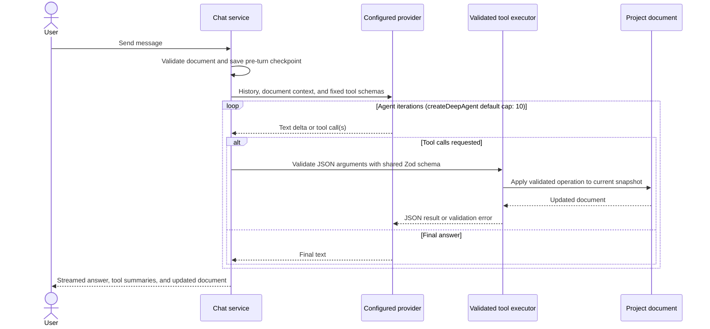

# AI agent

The optional AI editing layer lives in `electron/ai-edition/` and `src/components/ai-edition/`. It connects the editor's chat UI to configured language models and exposes a fixed set of validated operations over the shared project document.

## What it is and what gates it

The AI surface is always mounted. Without an API key configured the chat panel is a "no provider connected" welcome view, so the practical effect matches the old `AI_FEATURES_ENABLED = false` path: nothing agentic runs. (The chat rail entry itself stays — opening it shows the welcome view.) Configuring a provider (or signing in via OAuth) re-enables everything.

The boundary is intentionally narrow: only the LLM and agent UI are gated. The editing model, project panel, timeline, transcript and export surfaces ship to every user. Local Whisper transcription is privacy-preserving and is not gated.

## The tool loop

The deep-agent service builds one `createDeepAgent` instance per user turn. It streams model text and tool lifecycle events to the renderer while a mutable document holder ensures that each call in the turn sees the preceding call's result.

The agent is built with LangChain's `createAgent`, not `deepagents`' `createDeepAgent`, and pins `recursionLimit: 1000` explicitly. `createAgent` alone would fall back to LangGraph's default of 25 steps, which an auto-enhance pass placing one trim per silence exceeds without difficulty.

## Tool schema

The model never free-writes the project document. It can only call the fixed set of 21 tools built by `deep-agent/service.ts#buildTools`, described by `TOOL_DESCRIPTIONS` in the same file and validated against the Zod argument schemas in `agent-tools.ts`; the executor parses JSON, validates arguments, and returns either a new schema-valid snapshot or an error. Those three surfaces (descriptions, built tools, executor cases) are pinned to one another by `deep-agent/service.test.ts` — an earlier fourth surface, `AGENT_TOOL_SPECS`, described the tools in JSON Schema for a provider it had stopped reaching, and drifted. The tools operate on the same [document model](document-model.md) as manual editing.

| Tool | What it does | What it mutates |
|---|---|---|
| `getCurrentDocument` | Reads a compact project, asset, clip, trim, and modifier snapshot with explicit time bases. Each asset reports `hasCameraTrack` / `cameraVisible` / `hasCursorTelemetry` beside `hasTranscript` (`hasCursorTelemetry` is three-valued: `true`, `false` when the asset was checked and has none, `null` when it was not checked — never `false` for something we failed to look at), the document reports `hasAnyCamera` and `autoFocusAll`, and each zoom reports the `renderedScale` the viewer will see plus `customScale` / `depthIsOverridden` when a custom scale makes its `depth` inert. | Nothing. |
| `getTranscript` | Reads the transcript segments for an asset, or the primary asset, in full. On the production path a segment is one word, so a half-hour recording is a few thousand of them — there is no cap, and no per-model context budget to derive one from. | Nothing. |
| `getCursorTrack` | Reads the recorded pointer telemetry for an asset as a DIGEST: the moments the cursor sat still or clicked, each with its hold, its average position, its click count, its source time and the `virtualSec` that `addZoom` takes — never the raw samples. Answers `available:false` with `reason:"no-sidecar"` (checked, this asset has none) or `reason:"unavailable"` (could not be read from here), and the two are never conflated. | Nothing. |
| `addTrim` | Adds one source-time cut inside a clip. | `timeline.trimRanges`. |
| `addTrims` | Adds many cuts in one call, replaying `addTrim` per entry so the rules cannot drift apart. Each range stands alone: one that cannot be placed is refused by itself and named with its index and reason while the rest are applied, and the result leads with `requested` / `appliedCount` / `refusedCount`. Only a batch where nothing landed is an error. | `timeline.trimRanges`. |
| `setTrim` | Moves or resizes an existing source-time trim. | The matching `timeline.trimRanges` entry. |
| `setClipRange` | Changes a clip's source in/out points and relays clips back-to-back. | The clip range and any anchored regions clamped or removed by the shared timeline mutator. |
| `moveClip` | Reorders a placed clip by naming the clip it should play before (`null` = last). Preserves every clip id, source range, trim and anchored modifier. | Timeline clip order; anchored modifiers' derived ms follow their clip. |
| `replaceTimeline` | Rebuilds the primary-asset timeline from kept source-time intervals. Preserves the id, origin and label of every clip an interval reproduces exactly, carries existing trims through, and never touches another asset's trims. Refused when it would merge away, shorten or drop a clip, or when the intervals are not ascending (a reorder it cannot perform — the refusal points at `moveClip`). | Timeline clips and trim ranges. |
| `addZoom` | Adds a clip-anchored zoom over virtual timeline time. `depth` is an ordinal selecting from `ZOOM_DEPTH_SCALES` (1.25×–5.0×, non-linear); the result reports the resulting `renderedScale`. | `zoomRanges`. |
| `addZooms` | Adds many zooms in one call, replaying `addZoom` per entry, with the same per-entry refusal and reporting contract as `addTrims`. | `zoomRanges`. |
| `setZoom` | Moves, resizes, or restyles a zoom pill. Changing `depth` clears any `customScale` on that pill — otherwise the write is a no-op at render — and says so in the result. | The clip-anchored `zoomRanges` fragments represented by that pill. |
| `addSpeed` | Adds a clip-anchored speed region over virtual timeline time. | `legacyEditor.speedRegions`. |
| `setSpeed` | Moves, resizes, or changes an existing speed pill. | The corresponding `legacyEditor.speedRegions` fragments. |
| `addAnnotation` | Adds a positioned text annotation over virtual timeline time. | `annotations`. |
| `setAnnotation` | Moves, resizes, or changes an annotation's text. | The corresponding clip-anchored `annotations` fragments. |
| `addCameraFullscreen` | Adds a camera-fullscreen region over virtual timeline time; refused when no clip under the span comes from an asset with a linked `cameraTrack`, since such a region can only render nothing. | `legacyEditor.cameraFullscreenRegions`. |
| `setCameraFullscreen` | Moves or resizes a camera-fullscreen pill, under the same camera requirement as `addCameraFullscreen`. | The corresponding `legacyEditor.cameraFullscreenRegions` fragments. |
| `removeTrim` | Deletes a trim so its source span plays and exports again. | `timeline.trimRanges`. |
| `removeModifier` | Resolves and deletes a zoom, speed, annotation, or camera-fullscreen modifier by ID. | The matching modifier collection. |
| `removeClip` | Deletes a placed clip, closes the gap, and drops effects anchored only to it. The result names the modifiers and trims it took with it. | Timeline clips and affected anchored modifiers. |

Clips and trims use source time. Zoom, speed, annotation, and camera-fullscreen tools use virtual edited-timeline time; the executor converts these spans to the clip-anchored millisecond representation used by the document.

## Checkpoints and undo

Before a user message starts an agent turn, `chat-service.ts` clones the current document and associates it with that user message. All write calls produced by the turn operate from that checkpoint lineage, so restoring the message reverts the complete tool batch as one undo unit rather than undoing each model call separately. Rewind also truncates later conversation messages and invalidates later checkpoints.

## Context management

`chat-compaction.ts` uses a four-characters-per-token estimate, adds tool-summary text, and compares history with an 80,000-token budget. Once a session has at least four messages and reaches 70% of that budget, it asks the active provider to summarize the older half at a user-message boundary and inserts an `Earlier context` assistant message while retaining recent turns. Compaction failure leaves history unchanged. The chat path also sends only the latest 20 stored messages to the agent.

`chatBudget.ts` duplicates the same lightweight estimate in the renderer so Electron-only code is not bundled into the UI. It drives the context-percentage badge and the manual compact action. The heuristic deliberately leaves room for the system prompt and tool payloads; it is not a provider tokenizer.

## Sessions

Sessions are scoped first by project ID and then by session ID. Each session stores a generated ID, project ID, title, creation timestamp, messages, and per-user-message checkpoint references. The renderer can create, select, rename, delete, compact, and rewind sessions through the native bridge.

Chat sessions and checkpoints live only in nested process-memory `Map` objects in `chat-service.ts`. They are not written to project files or user data, so restarting Electron loses the conversation and its restore checkpoints. Provider configuration and encrypted credentials are separate and do persist.

## Known gaps

- Chat sessions and message checkpoints have no durable persistence.
- `allowAgentEdits` has no per-turn approval channel. When it is off the agent reads freely, is told by its system prompt to state the edit and ask, and has every write refused by `executeAgentTool` with a `consent_required` payload; the returned document is withheld as well. But there is no way for the user to answer "yes, go ahead" for one turn — they have to re-enable the setting in Settings → AI, which is what the refusal tells the model to say.
- Cursor telemetry is read through an injected `CursorTelemetryReader` (`electron/ipc/handlers.ts` builds the only production one, behind `resolveApprovedVideoPath`). A runtime with no reader wired answers `reason: "unavailable"` on every call and reports `hasCursorTelemetry: null` — honest, and useless. There is no cache: a turn probes each asset's sidecar once and reads it in full only if the model asks.
- The digest reports dwells and click counts, not the raw samples, and `readCursorSidecar`'s normalizer flattens `double-click` / `right-click` / `middle-click` to `move` before the digest sees them, so those clicks are currently invisible. The digest already counts the wide union; the narrowing is upstream, in `CursorRecordingSample`.
- The deep-agent instance is rebuilt for every turn without a LangGraph checkpointer, so stateful agent threads do not persist independently of the explicit chat history.
