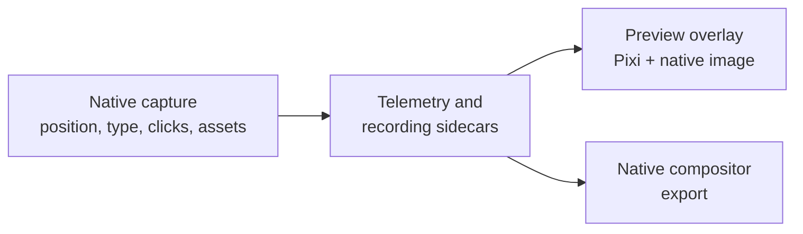

# Cursor pipeline

The cursor feature records system-cursor position and, where the native provider is available, cursor assets separately from the screen video, then re-renders the cursor as a themed, smoothed overlay instead of baking it into the capture. Its shared rendering and asset code lives in `src/lib/cursor/`; native capture and IPC adapters live under `electron/native/` and `electron/native-bridge/cursor/`; the editor overlay is `src/components/ai-edition/CursorPreviewLayer.tsx`.

## Capture

Native capture keeps cursor data separate from the video frame. On Windows, the WGC cursor sampler in `electron/native/wgc-capture/src/cursor-sampler.cpp` samples the system cursor during desktop duplication and records its position, hotspot, bitmap, and cursor type. On macOS, the ScreenCaptureKit cursor helper at `electron/native/screencapturekit/Sources/OpenScreenMacOSCursorHelper/main.swift` samples the current system cursor, emits unique bitmap assets, and records cursor samples plus left-button interaction events. The recording sessions under `electron/native-bridge/cursor/recording/` select and wrap the platform provider; `telemetryCursorAdapter.ts` provides the position-only fallback when native assets are unavailable. The resulting contracts are `CursorRecordingData` and `CursorRecordingSample` in `src/native/contracts.ts`.

## Telemetry

Position telemetry is represented by `CursorTelemetryPoint` in `src/lib/cursorTelemetryBuffer.ts`. Each point contains `timeMs`, the offset from recording start, and `cx`/`cy`, clamped ratios of the captured surface (`cursorTelemetryBuffer.ts:1-10`). The main-process `CursorTelemetryBuffer` starts a session with a recording id, appends samples, and finalizes them into FIFO batches keyed by that id (`cursorTelemetryBuffer.ts:25-34`). This key keeps asynchronous persistence and discard operations associated with the correct recording. Native cursor samples use the same recording-time convention, and `crates/compositor/src/cursor.rs:100-123` loads a selected window by subtracting its offset so the first sample is at time zero.

## Rendering

`CursorPreviewLayer` is mounted above the video and loads both native recording data and telemetry through `useCursorRecordingData` and `useCursorTelemetry` (`src/components/ai-edition/CursorPreviewLayer.tsx:42-50`). Its animation loop updates the Pixi telemetry overlay and the native-cursor DOM image from the current playback time (`CursorPreviewLayer.tsx:187-255`). The shared cursor library supplies path smoothing, native asset selection, click bounce, and directional motion blur. The native compositor in `crates/compositor/src/cursor.rs` interpolates raw samples, applies the same 240 Hz spring-style smoothing, and computes click-bounce timing (`cursor.rs:126-196`). Preview and export therefore consume the same telemetry and cursor rules rather than maintaining independent cursor tracks.

## Settings

The cursor settings pane is `CursorPane` in `src/components/ai-edition/RightPanes.tsx`; the current v4 inspector exposes it through the cursor facet in `src/components/ai-edition/v4/FloatingInspector.tsx:57-63,1073`. It controls showing the cursor, clipping it to the canvas, theme, size, smoothing, motion blur, and click bounce. `RightPanes.tsx:1592-1692` binds those controls to editor settings and forwards the rendering parameters to the native compositor. The shared preview reads the same values from `useEditorSettings` (`CursorPreviewLayer.tsx:47,192-202`), so live changes affect both rendering paths.

## Auto-follow

Cursor telemetry also drives camera focus for auto-follow zooms. `src/lib/zoomMath/cursorFollowUtils.ts` interpolates the cursor at content time and applies distance-adaptive, frame-rate-independent smoothing. The zoom-region utilities use that focus for preview, while the export frame renderer uses the corresponding focus during export. The native compositor keeps a raw track for cursor placement and derives a separately smoothed follow track (`crates/compositor/src/cursor.rs:16-24,126-136`), preventing camera motion from changing the cursor's actual recorded position.

## Bundled assets

The themed cursor packs are stored under `public/cursors/<id>/` and contain arrow and pointer PNGs registered in `src/lib/cursor/cursorThemes.ts`. The built-in native replacement SVG set is under `src/assets/cursors/` and is selected by `src/lib/cursor/nativeCursor.ts`, which maps captured cursor types to render assets and hotspots.

The same built-in art also exists as PNGs under `public/cursors/default/`, generated from those SVGs by `scripts/generate-default-cursor-sprites.mjs`. The native compositor decodes png/jpeg from a real path and cannot read the SVGs, which exist only as bundler URLs in the renderer — so without the PNG set it had no default art and drew a placeholder dot-and-ring instead of a pointer. Regenerate rather than hand-editing: the script also emits the `DEFAULT_CURSOR_SPRITES` hotspot table, which would otherwise drift from the images.

## Sprite selection and the hotspot

`resolveCursorSprites` (`cursorThemes.ts`) resolves one sprite per `NativeCursorType`: the selected theme's art where it has any, the built-in art everywhere else. The packs only ship an arrow and a pointer while a recording walks through a dozen OS states, so this fallback is what keeps a text caret from rendering as an arrow. `resolveSceneAssetPaths` (`compositorViewService.ts`) turns that table into absolute on-disk paths and puts it in the scene as `cursor.cursorSprites`; the compositor picks by the state in the track and falls back to the arrow.

Each sprite carries its hotspot as a **fraction of its own image**, not in pixels. The compositor scales the sprite to the cursor-size setting, so a pixel offset would need rescaling at draw time; a fraction survives any scale. Both renderers anchor on it (`cursor_sprite_dst` in `compositor.rs`, and `renderAsset.hotspot* × scale` in the web paths) — drawing from the sprite's centre instead made an enlarged cursor point further and further from its target.

## Known gaps

macOS single-window capture can report a cursor offset relative to the captured surface. This remains an open platform-specific alignment issue; display capture does not exhibit the same verified gap.
