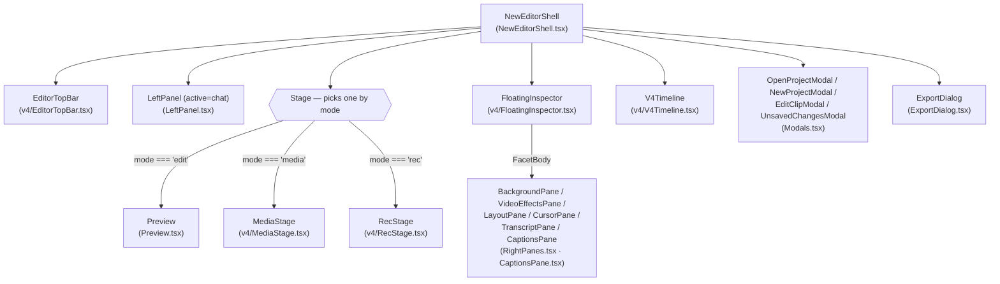

# Editor shell — v4 layout

The desktop editor is one component,
[`src/components/ai-edition/NewEditorShell.tsx`](../../src/components/ai-edition/NewEditorShell.tsx),
that mounts a top bar, a body split between an optional agent chat column and a
stage, and a bottom timeline. The import list at the top of `NewEditorShell.tsx`
is the authoritative answer to "what is mounted" — anything not imported there is
not part of this shell. The v4 design and its tokens live under
[`design/`](../../design/) (see [Design source](#design-source)); the shell
consumes the tokens through CSS custom properties rather than hard-coding
colours.

## Component tree



The shell is the single owner of mode, transport (`playing`/`currentTimeSec` come
from `useProjectStore`), the inspector's `facet` and `open` flags, the
modal-stack, and the timeline's `showTimeline` switch (`rec` mode hides it). All
of those are local React state, with the document itself read through
`useProjectStore` and region mutations through
[`useTimeline`](../../src/lib/ai-edition/store/useTimeline.ts).

## Surfaces

| Surface | Component file | What the user does there |
|---|---|---|
| **Top bar** | `src/components/ai-edition/v4/EditorTopBar.tsx` | Toggles the chat column; chooses the editor mode; opens / saves / renames the project; exports; switches theme and language. (`EditorTopBar` props in `NewEditorShell.tsx` `:1114-1130`.) |
| **Stage — Edit mode** | `src/components/ai-edition/Preview.tsx` (mounted at `NewEditorShell.tsx` `:1180`) | Plays the timeline through the in-DOM preview; live drag of zoom focus and annotation position/size calls back into `useTimeline`; selection of an annotation id routes through `useTimeline.selectRegion`. |
| **Stage — Media mode** | `src/components/ai-edition/v4/MediaStage.tsx` | Searches, adds, regenerates transcripts for the assets in the project. The variant that the timeline shows in this mode is "media" (timeline height, no lanes). |
| **Stage — Rec mode** | `src/components/ai-edition/v4/RecStage.tsx` | Pre-flight config for a new recording — mic / camera / system audio / cursor capture mode — then hands off to the standalone recorder HUD window when the user hits record. |
| **Bottom timeline** | `src/components/ai-edition/v4/V4Timeline.tsx` | Renders the clips, the ruler, and the five lanes (`annPills`, `speedPills`, `trimPills`, `zoomPills`, `cameraFullscreenPills`, computed at `:321-363`). Owns transport (play / prev / next / loop), zoom/pan, scrub, drag-and-drop of asset cards, the "smart zooms + cuts" AI prompt, and resize/move/delete of every pill. Pills render through `coalesceRegionsForRuler` and `coalescedTrimGroups` so what the user sees is exactly what the rules in [timeline-model.md](timeline-model.md) describe. |
| **Floating inspector** | `src/components/ai-edition/v4/FloatingInspector.tsx` | Floating facet rail over the stage; the open panel either shows the `FacetBody` for the current facet (`background` / `effects` / `layout` / `cursor` / `captions` / `transcript`) or, when a region is selected, a `SelectionPane` (`:444`) that edits the selected pill by id. The "pencil" rail button opens `EditClipModal` for crop + trim. |
| **Left chat column** | `src/components/ai-edition/LeftPanel.tsx` | Only mounted when `mode === "edit"` and `chatOpen` is true (`NewEditorShell.tsx` `:1133-1151`). Sends user messages to the LLM via IPC. Resize handle is `v4.chatResizeHandle`; width persists in `localStorage` as `os-editor-chat-width`. |
| **Modals** | `src/components/ai-edition/Modals.tsx` | `OpenProjectModal`, `NewProjectModal`, `EditClipModal` (per-clip crop + in/out), `UnsavedChangesModal`. Mounted at the shell level (`:1286-1332`) so every trigger site reuses the same instance. |
| **Export dialog** | `src/components/ai-edition/ExportDialog.tsx` | Format / quality / frame-rate / codec / size; calls `exportAxcutDocument` (GIF path, WebCodecs) or `exportMultiNative` (MP4 path, native D3D compositor). The MP4 path is the one that goes through `src/lib/ai-edition/exporter/documentExporter.ts`'s `projectRegionsToSourceTime` and the multi-clip native bridge. |
| **Captions pane** | `src/components/ai-edition/CaptionsPane.tsx` | Mounted as a facet body from `FloatingInspector.tsx` (`:1077`). Controls caption appearance + translations; the cues themselves are a derived view over `document.transcripts` (see [`src/lib/ai-edition/captions/`](../../src/lib/ai-edition/captions/)). |

## Modes and facets

`mode` is local React state in `NewEditorShell` (`:75`); `facet` is local React
state at `:84`. Both are exported as string unions from the components that
introduce them.

### EditorMode (`v4/EditorTopBar.tsx:20`)

```ts
export type EditorMode = "media" | "edit" | "rec";
```

| Mode | What it shows |
|---|---|
| `"media"` | `MediaStage` over a "media" variant of the timeline (no lanes). The user searches transcripts, re-runs Whisper for an asset, picks a language, etc. |
| `"edit"` | `Preview` over the floating inspector with the standard five-lane timeline. The agent chat column can be opened. This is the mode the document is actually mutated in. |
| `"rec"` | `RecStage` pre-flight config (mic, camera, system audio, cursor mode). The bottom timeline is hidden. Hitting record hands off to the standalone recorder HUD window; closing `RecStage` returns the user to `edit`. |

### Facet (`v4/FloatingInspector.tsx:57`)

```ts
export type Facet = "background" | "effects" | "layout" | "cursor" | "captions" | "transcript";
```

| Facet | Body component | Purpose |
|---|---|---|
| `"background"` | `BackgroundPane` (`src/components/ai-edition/RightPanes.tsx:178`) | Wallpaper, shadow intensity, blur, motion blur, corner radius, padding — all read out of `document.legacyEditor`. |
| `"effects"` | `VideoEffectsPane` (`RightPanes.tsx:1218`) | Per-clip / per-document video effects that aren't zoom / speed / annotation (cursor zoom, etc.). |
| `"layout"` | `LayoutPane` (`RightPanes.tsx:1376`) | Webcam layout (PiP / side / full / off), mask shape, mirroring — all also from `legacyEditor`. |
| `"cursor"` | `CursorPane` (`RightPanes.tsx:1544`) | Cursor smoothing, theme, click ring, halo. |
| `"captions"` | `CaptionsPane` (`CaptionsPane.tsx`) | Caption appearance (font, size, background, animation) and translations. The pane owns the `transcribe` action — it's the only place that runs it from the shell. |
| `"transcript"` | `TranscriptPane` (`RightPanes.tsx:475`) | Editable view of the transcript words / segments. Writes back to the document. |

Selecting a region on the timeline supersedes the current facet body: the
inspector opens (if it was closed) and renders the `SelectionPane` for that
region's kind. Clicking the empty area clears the selection and closes the
selection pane.

## Adding a region kind

An ordered checklist of every file that must move when a new modifier
(`"blur"`, `"captionHighlight"`, …) joins the existing five. The kind is added
to `RegionKind` in `src/lib/ai-edition/document/timeline.ts` (`"zoom" |
"trim" | "annotation" | "speed" | "cameraFullscreen"`, `:18`); every site that
switches on it is checked below. Each path has been verified on this branch.

1. **Schema** — `src/lib/ai-edition/schema/index.ts`. Add a `xxxRegionSchema`
   Zod object that extends the modifier base (`{id, startMs, endMs,
   clipId?, sourceStartSec?, sourceEndSec?, …payload}`), and add the array to
   `documentSchemaShape` next to `zoomRanges` and `annotations` (`:496-497`).
   The v4→v5 preprocess at `:555-595` re-anchors every region kind — add the
   new array to the `anchor(...)` block so freshly-loaded v4 documents convert
   on parse.
2. **Identity** — `timelineMap.regionIdentityKey` already does the right thing:
   `NON_IDENTITY_FIELDS` (`:122`) lists only position + provenance, so every
   property of the new kind participates in identity automatically. Confirm
   with a test in `src/lib/ai-edition/timeline/timelineMap.test.ts`.
3. **Store action in `useTimeline`** — `src/lib/ai-edition/store/useTimeline.ts`.
   Add `addXxx`, `updateXxxSpan`, `removeXxx` that route through
   `anchorRegionsWithDerivedMs` (`:134, :163, :278, :305, :329`),
   `replacePillSpan`, and `dropPillsByIds` (imports at `:23-28`); expose the
   array as `tl.xxxRegions` on the returned object. Add the new kind to
   `RegionKind` (`document/timeline.ts:18`); add a `removeRegion` case
   (`document/timeline.ts:591`) for batch / single deletes.
4. **Lane in `V4Timeline`** — `src/components/ai-edition/v4/V4Timeline.tsx`.
   Compute the pills at the same call site as the four existing lanes
   (`coalesceRegionsForRuler(tl.xxxRegions).map(...)` near `:463-511`), render
   them through `renderPills` inside a `<div className={styles.tlLane}>`
   block (`:1504-1512`), and extend the `kind` union at `:334` so drag,
   resize, and delete handler switches route correctly.

   **Coordinates on the timeline canvas obey one rule**: position and size are
   `pctOf(sec)` percentages of the whole timeline — pills, ruler ticks, playhead,
   snap guide and clips all use it, which is what keeps them aligned when the
   canvas is scaled by `1/navSpan` for zoom. Anything that must be a fixed
   *screen* size (a minimum width, a grab handle, a snap radius, the gutter
   between two clip cards) is expressed in **px**, converted through `pxPerSec`
   where it needs to reach time. A percentage used as a screen constant is a
   duration in disguise: it scales with the recording, so a `1.5%` minimum pill
   width was a 27-second pill on a 30-minute project, and a flex `gap` used as a
   clip separator displaced every clip after it. See `pillAffordance`,
   `PILL_SNAP_PX` and `CLIP_GUTTER_PX`, and the invariants in
   `V4Timeline.geometry.test.tsx`.
5. **Inspector selection pane** — `src/components/ai-edition/v4/FloatingInspector.tsx`.
   The `SelectionPane` (`:444`) is the kind-switch site, not the facets; add
   an `if (selection.kind === "xxx") { ... }` branch alongside `:513, :612,
   :629, :956` that reads `tl.xxxRegions`, calls the store's `updateXxx*`
   methods, and renders a delete button matching the existing style.
6. **Preview path** — `src/components/ai-edition/Preview.tsx` mounts only
   zoom, annotation, speed, camera-fullscreen, and trim regions (see
   `NewEditorShell.tsx` `:1185-1189`). Add the new array to `Preview`'s
   props, pass it through, and have the renderer consume it from
   `tl.xxxRegions`.
7. **Native preview scene** —
   `src/native/sceneDescription.ts`. Add a `projectedXxxRegions = projectRegionsToSource(...)`
   call next to the existing four (`:489, :508, :517, :531`) and serialize
   the result into `SceneDescription`.
8. **Native playback sync** — only needed if the new region affects the
   active clip selection. `src/native/useNativePlaybackSync.ts` already calls
   `resolveNativePosition` (`:22, :39`) which is region-agnostic; add a region
   query here only if the modifier gates a transition.
9. **Multi-clip export** —
   `src/lib/ai-edition/exporter/documentExporter.ts`. Add a
   `xxxRegions = projectRegionsToSourceTime(...)` line alongside `:223, :238,
   :260, :265` and pass the result to the render plan / `exportAxcutDocument`.
   Identity single-clip projects need no change (source == virtual).
10. **Captions layer** — only if the kind affects cue placement. Captions are
    a derived view over `document.transcripts`; if the new region must
    intersect captions, add the projection in
    `src/lib/ai-edition/captions/cues.ts` (`captionCuesToTextRegions`,
    `sourceSpanToTimelineSpans`) so preview and export agree.
11. **Agent LLM tools** —
    `electron/ai-edition/agent-tools.ts`. Add a write tool that routes
    through `anchorForAgent` (`:89-95`) and `replacePillSpan` (imports `:22-26`),
    and include the new array in `coalesceForAgent(...)` (`:77-86`) inside
    the `getCurrentDocument` snapshot (see `:527-575`).

## Design source

The v4 editor visual design lives in [`design/`](../../design/), with the
canonical reference at [`design/DESIGN.md`](../../design/DESIGN.md). Tokens
are split by concern in
[`design/tokens/`](../../design/tokens/) — `colors.css`, `fonts.css`,
`radii.css`, `spacing.css`, `typography.css`, `elevation.css`, `effects.css`,
plus a `v4.css` roll-up that the editor imports. Components consume those
tokens as CSS custom properties (e.g. `var(--surface)`, `var(--fg)`,
`var(--accent)`, `var(--danger)`, `var(--r-md)`, `var(--sp-2)`) rather than
hard-coding hex values, so theme + density changes propagate without per-file
edits. Inline styles in the editor (e.g. `FloatingInspector.tsx`'s `clipPickerOpen`
panel at `:172-186`) follow the same rule — they reference the tokens, not
raw colours.

## Known gaps

- `rec` mode hides the bottom timeline row (`NewEditorShell.tsx` `:1112`
  grid template, `:1247` `showTimeline`). Switching back to `edit` keeps the
  previous `timelineHeightPx` and `chatWidthPx` because they are persisted to
  `localStorage`; nothing wires those numbers to a settings pane.
- The chat column is only rendered when `mode === "edit"` and `chatOpen` is
  true; in `media` and `rec` modes the chat button on the top bar still
  toggles `chatOpen`, but the column will not appear until the user returns
  to `edit`. This is intentional (the AI-edition chat reads from the
  in-edit document state), not a bug.