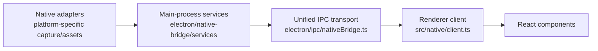

# Native bridge architecture

The native bridge gives renderer code one typed interface for platform capabilities, project state, cursor telemetry, compositing, and AI-edition services. Shared contracts and the renderer client live in `src/native/`; Electron handlers and domain services live in `electron/ipc/` and `electron/native-bridge/`.

## Layers



1. **Native adapters** implement platform-facing interfaces. Cursor telemetry is adapted by `electron/native-bridge/cursor/telemetryCursorAdapter.ts`; native compositor loading is isolated in the compositor service.
2. **Main-process services** own state and domain behavior. They receive a `NativeBridgeState` and application callbacks from `NativeBridgeContext` rather than exposing Electron primitives to React. The state is created by `createNativeBridgeState(platform)` and exposes `getState` plus the per-domain setters as direct property assignments.
3. **Unified IPC transport** is registered by `registerNativeBridgeHandlers` in `electron/ipc/nativeBridge.ts`. It handles one channel, validates the request shape, dispatches by domain and action, and wraps every result.
4. **Renderer client** in `src/native/client.ts` generates request IDs, invokes the preload transport, unwraps successful data, and throws the contract error for failures. Renderer features use `nativeBridgeClient` rather than importing main-process services.

The boundary is deliberately narrow: adapters know how to talk to an operating system or native addon; services translate that capability into app-domain operations; IPC carries typed data; the renderer consumes promises.

## The invoke contract

The transport channel and protocol version are constants in `src/native/contracts.ts`:

```ts
export const NATIVE_BRIDGE_CHANNEL = "native-bridge:invoke";
export const NATIVE_BRIDGE_VERSION = 1;
```

`NativeBridgeRequest` is a discriminated union. Each request supplies a `domain`, an `action`, an optional action-specific `payload`, and an optional `requestId`. The handler first accepts only values with string `domain` and `action`; the union then supplies the compile-time list of valid operations.

Responses use the `NativeBridgeResponse<TData>` union. A successful response is `NativeBridgeSuccess<TData>`:

```ts
interface NativeBridgeSuccess<TData> {
  ok: true;
  data: TData;
  meta: NativeBridgeMeta;
}
```

A failed response is `NativeBridgeFailure`:

```ts
interface NativeBridgeFailure {
  ok: false;
  error: NativeBridgeError;
  meta: NativeBridgeMeta;
}
```

`NativeBridgeMeta` contains the protocol `version`, the request ID, and `timestampMs`. `NativeBridgeError` contains a stable `code`, a user-facing `message`, and a `retryable` boolean. The defined `NativeBridgeErrorCode` values are `INVALID_REQUEST`, `UNSUPPORTED_ACTION`, `NOT_FOUND`, `UNAVAILABLE`, and `INTERNAL_ERROR`. Handlers create metadata even when a request is malformed, so callers can correlate failures.

The single channel is `native-bridge:invoke`, registered with `ipcMain.handle` in `electron/ipc/nativeBridge.ts`. The preload exposes `invokeNativeBridge`; `src/native/client.ts` adds a UUID request ID when the caller omitted one and forwards the request. `requireNativeBridgeData<TData>` checks `ok`, returns `data` on success, and throws with the contract error message otherwise.

Capabilities are queried with the `system` / `getCapabilities` request and return `SystemCapabilities`. That type reports the bridge version and normalized `NativePlatform`, cursor capabilities (`telemetry`, `systemAssets`, and `provider`), and whether a current project context is available. `nativeBridgeClient.system.getCapabilities()` is the capability query; clients should use it before attempting optional native behavior.

## Services

The files under `electron/native-bridge/services/` each own one domain. The IPC handler constructs them once during `registerNativeBridgeHandlers` and dispatches requests to the appropriate instance.

| Service | What it owns |
| --- | --- |
| `systemService.ts` | Normalized platform identity, asset-base-path resolution, and the aggregate system/cursor capability response. |
| `projectService.ts` | Current project/video context and project file load, save, path, and clear operations. |
| `cursorService.ts` | Cursor capability reporting plus loading complete cursor recording data and telemetry through the cursor adapter. |
| `compositorViewService.ts` | The native compositor-view addon lifecycle and view operations, with a safe no-op when the addon is unavailable. |
| `aiEditionService.ts` | AI-edition project/document operations, LLM configuration actions, chat sessions, streaming chat, undo/rewind, context usage, and timeline operations. |

The service table describes domains, not every action. The action-to-service mapping remains in the central dispatcher, which keeps transport validation and response envelopes consistent.

## The browser shim

`src/native/browserShim.ts` detects a plain browser by the absence of `window.electronAPI` and by the `browser` or editor-window URL mode. In that mode it supplies a browser implementation of the expected surface so the renderer can run without an Electron shell. It fakes plausible desktop sources for the source picker, stores recording preferences in `localStorage`, uses a hidden file input and blob URLs for video selection, and provides project, chat, and LLM state backed by browser storage. Its `invokeNativeBridge` returns a successful null-shaped response for operations that do not need a browser implementation.

The shim exists for fast renderer development in Chrome or Firefox: desktop capture, file dialogs, native addons, and main-process services do not exist in a normal browser tab. It therefore preserves the renderer's boot and interaction paths without pretending that browser mode has the native capability itself.

A new bridge operation must have a browser-shim entry when renderer code can call it in browser mode. Add the corresponding fake or safe default to `createShimElectronAPI` or `createShimBridgeClient`; otherwise browser-mode development breaks when the renderer reaches that operation. The shim's shape must continue to match the preload-facing API closely enough that the real client and browser client remain interchangeable.

## Invariants

- Renderer code crosses the native boundary through `src/native/client.ts` and its domain clients.
- Main-process state stays behind services and `NativeBridgeState`; it is not reconstructed independently in each renderer.
- Every response carries `NativeBridgeMeta`, and every failure uses a `NativeBridgeErrorCode` rather than an arbitrary transport exception.
- Capability probing is explicit. An unavailable addon or platform feature returns a capability or `UNAVAILABLE` result instead of making renderer code guess from the platform string.
- The preload remains the only renderer-to-main transport surface for this bridge. `electron/preload.ts:22` exposes the `electronAPI` object, including its `invokeNativeBridge` method; the legacy object is still present for compatibility, while new native operations belong on the unified bridge.

## Known gaps

The legacy `window.electronAPI` surface still exists in `electron/preload.ts:22` and remains broader than the unified native bridge. It is retained for compatibility with existing recording, project-window, and file operations. New native-facing operations should not extend that ad hoc surface: they should add a contract request, a service dispatch, a renderer client method, and a browser-shim entry.
