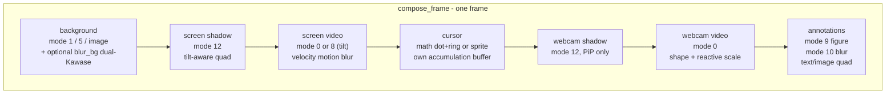

# Native compositor

`crates/compositor/` is the Rust + Direct3D 11 crate behind both the live preview and the MP4
export. It exposes its compositor and pipeline to Electron through a small
napi-rs addon (`compositor-view-napi/`) loaded by
[`compositorViewService`](../../electron/native-bridge/services/compositorViewService.ts).
The whole GPU-resident path lives here — `demux → decode → composite → encode → mux`,
zero CPU readback between stages — and is shared, with the same scene contract, by
[preview.md](preview.md) (frame-by-frame RGBA8 pull) and
[export-pipeline.md](export-pipeline.md) (multiclip MP4 write). The performance
numbers and the rejected alternatives that drove the design live in
[engineering/rendering-performance.md](../engineering/rendering-performance.md).

A single `ID3D11Device` ([`crates/compositor/src/d3d.rs`](../../crates/compositor/src/d3d_windows.rs))
is shared by every consumer on the path: the ffmpeg `D3D11VA` decoder, the HLSL
compositor, the `h264_amf` encoder, and the live swapchain. It is created with
feature level **11_1**, the flags `VIDEO_SUPPORT | BGRA_SUPPORT` (`VIDEO_SUPPORT`
is required for `D3D11VA`; `BGRA_SUPPORT` enables the DirectWrite/Direct2D path
used by text annotations), and `ID3D10Multithread::SetMultithreadProtected(TRUE)`
— ffmpeg's decoder thread and the render loop touch the device concurrently,
and without that flag the runtime corruption is silent.

## Module map

| source | responsibility |
|---|---|
| [`crates/compositor/src/lib.rs`](../../crates/compositor/src/lib.rs) | crate root: declares every module below. Nothing else — the CLI/bench/GUI dispatcher it used to hold lives in the POC crate now |
| [`crates/compositor/src/d3d.rs`](../../crates/compositor/src/d3d_windows.rs) | the single `ID3D11Device` (feature level 11_1, `VIDEO_SUPPORT`, multithread-protected) |
| [`crates/compositor/src/ffi.rs`](../../crates/compositor/src/ffi.rs) | bindgen-generated `libav*` bindings (ffmpeg 8.x headers) |
| [`crates/compositor/src/compositor.rs`](../../crates/compositor/src/compositor_windows.rs) | HLSL compositor — every per-frame pass (`compose_frame`, background, screen, webcam, cursor, annotations, shadows, blur) |
| [`crates/compositor/src/scene.rs`](../../crates/compositor/src/scene.rs) | the `Scene` struct parsed from the app's `SceneDescription` JSON |
| [`crates/compositor/src/regions.rs`](../../crates/compositor/src/regions.rs) | zoom / speed / Full Camera regions — envelope shapes and per-frame state sampling |
| [`crates/compositor/src/pipeline.rs`](../../crates/compositor/src/pipeline_windows.rs) | demux + `D3D11VA` decode + composite + AMF encode + mux (`run_c0` for decode/encode only, `run_composited` for the full path) |
| [`crates/compositor/src/audio.rs`](../../crates/compositor/src/audio.rs) | per-clip audio decode, swresample → f32 planar 48 kHz stereo, WSOLA speed stretch, multi-track mix, AAC encoder |
| [`crates/compositor/src/cursor.rs`](../../crates/compositor/src/cursor.rs) | `.cursor.json` parser + interpolated cursor track (position, click bounces, adaptive follow samples) |
| [`crates/compositor/src/text.rs`](../../crates/compositor/src/text_windows.rs) | DirectWrite + Direct2D text rasterisation for annotation labels, cached per (content, style, box) |
| [`crates/compositor/src/text_anim.rs`](../../crates/compositor/src/text_anim.rs) | text-annotation appearance animations (port of the TS animation curves, in fractions of the output short side) |
| [`crates/compositor/src/config.rs`](../../crates/compositor/src/config.rs) | cumulative bench configs C0..C8 (each adds one layer: composite, rounded corners, shadow, background blur, zoom, layout animation, cursor, motion blur) |
| [`crates/compositor/src/live.rs`](../../crates/compositor/src/live.rs) | off-screen view: `Player` + `Compositor::compose_frame` → RGBA8 staging texture, pulled by the napi addon |
| [`crates/compositor/src/shaders.hlsl`](../../crates/compositor/src/shaders.hlsl) | all GPU effects (modes 0/1/5/8/9/10/12 — see pipeline below), compiled at runtime via Fxc |

Six of those modules exist twice, once per platform, and `lib.rs` cfg-re-exports the pair
under one name — so `crate::d3d`, `crate::compositor`, `crate::pipeline` and `crate::text`
mean the Windows file above on Windows and the macOS file below on a Mac, and every
call-site stays portable. The rows above name the `_windows` half because that is what
their prose describes (HLSL, D3D11VA, AMF, DirectWrite); the macOS half is:

| source | responsibility |
|---|---|
| [`crates/compositor/src/d3d_macos.rs`](../../crates/compositor/src/d3d_macos.rs) | the `MTLDevice` + `MTLCommandQueue`. Metal has no software rasteriser, so `Backend::Cpu` exists only for API symmetry and is never produced |
| [`crates/compositor/src/compositor_macos.rs`](../../crates/compositor/src/compositor_macos.rs) | Metal compositor. `CVPixelBuffer` → `MTLTexture` via `CVMetalTextureCache` (zero-copy over IOSurface), then the MSL passes. First-pass engine: full-canvas only, the layered passes are not driven yet |
| [`crates/compositor/src/pipeline_macos.rs`](../../crates/compositor/src/pipeline_macos.rs) | demux + VideoToolbox decode (+ software fallback) + composite + `h264_videotoolbox` encode + mux |
| [`crates/compositor/src/mac_frames.rs`](../../crates/compositor/src/mac_frames.rs) | the software-decode axis: libavcodec → swscale → NV12 → IOSurface-backed `CVPixelBuffer`, presented under the same 4-field AVFrame contract as the hardware path |
| [`crates/compositor/src/text_macos.rs`](../../crates/compositor/src/text_macos.rs) | CoreText + CoreGraphics text rasterisation, same `TextSpec::cache_key` as the Windows side |
| [`crates/compositor/src/shaders.metal`](../../crates/compositor/src/shaders.metal) | the MSL port of `shaders.hlsl`, compiled at runtime via `newLibraryWithSource`. Same nine entry points; resources are entry-point parameters rather than globals, which is the one thing MSL does not let you transcribe from HLSL |
| [`crates/compositor/src/timeline_walk.rs`](../../crates/compositor/src/timeline_walk.rs) | portable, not per-platform: the clip walk both exports (MP4, GIF) and both backends share, so "which source frame belongs at output frame N" is defined exactly once |

Two more modules sit in the POC crate ([`crates/poc-d3d/`](../../crates/poc-d3d)) rather than the
library. Nothing packages them — they drive the library for measurement and eyeballing:

| source | responsibility |
|---|---|
| [`crates/poc-d3d/src/app.rs`](../../crates/poc-d3d/src/app.rs) | standalone Win32 GUI (combo preset, Play/Pause, Export, progress bar) — wraps the measured pipeline for interactive demo |
| [`crates/poc-d3d/src/bench.rs`](../../crates/poc-d3d/src/bench.rs) | mode dispatcher (`--live` / `--cfg` bench / GUI) and the C0..C8 fps harness |
| [`crates/poc-d3d/src/main.rs`](../../crates/poc-d3d/src/main.rs) | thin `main` that calls `bench::run()` |

## The compositing pipeline

Every visible frame is rasterised into one RGBA render target
(`OUT_W × OUT_H = 1920×1080`, then optionally bilinearly resized to the real
output aspect). `Compositor::compose_frame`
([`crates/compositor/src/compositor.rs:1421`](../../crates/compositor/src/compositor_windows.rs))
runs one fixed draw order — derived from the per-frame math it performs, not
from any list the caller can reorder — and `shaders.hlsl` keys each effect off
the `mode` field of the same `LayerCB` struct, so the modes below are exactly
what `shaders.hlsl` actually implements:

1. **Background** (the wallpaper). `mode = 1` for a solid colour
   ([`compositor.rs:1761`](../../crates/compositor/src/compositor_windows.rs)),
   `mode = 5` for a CSS gradient
   ([`compositor.rs:1765`](../../crates/compositor/src/compositor_windows.rs)), or a cover-fitted
   image loaded through `draw_image_bg`
   ([`compositor.rs:1156`](../../crates/compositor/src/compositor_windows.rs)). When the
   scene's `effects.blur` is on, `blur_bg` (dual-Kawase, ~18 px) blurs whatever
   was just drawn — that is what "Blur BG" does, mirroring the web
   `frameRenderer.blurredBackgroundLayer`
   ([`compositor.rs:1807`](../../crates/compositor/src/compositor_windows.rs)).
2. **Screen shadow.** Drop-shadow SDF; opacity scales with the `shadow`
   slider. The shadow tracks the rendered silhouette — a tilted plane gets a
   tilted shadow, not a rect shadow
   ([`compositor.rs:1885`](../../crates/compositor/src/compositor_windows.rs) /
   [`compositor.rs:1882`](../../crates/compositor/src/compositor_windows.rs), `mode = 12`).
3. **Screen video.** Cropped from the active clip's source, with the zoom region
   applied to its UVs and rounded corners via SDF. `mode = 0` for the standard
   quad ([`compositor.rs:1898`](../../crates/compositor/src/compositor_windows.rs));
   `mode = 8` for the 3D tilt path (zoom `rotation: iso | left | right`,
   [`compositor.rs:1950`](../../crates/compositor/src/compositor_windows.rs)). Motion blur
   uses the previous frame's UV delta as a per-pixel velocity vector and samples
   along it (the "blur by velocity" optimisation — early-outs on still frames).
4. **Cursor.** A sprite picked from `cursor.cursorSprites` by the OS cursor state
   recorded in the `.cursor.json` track (`arrow`, `text`, `pointer`, the resize
   handles…), anchored so the sprite's hotspot — a 0..1 fraction of its own image,
   so it survives the size slider — lands on the recorded position. Falls back to
   the arrow for an unknown state, then to a math dot+ring if the app supplied no
   sprites at all. When the screen is tilted the cursor lives *on* the plane: its
   position is kept in plane coordinates and its four sprite corners go through the
   same projection as the video, drawn by `mode = 13` — the mode-8 warp sampling the
   cursor texture instead of the video. It replaces a pointer that was part of the
   captured image, so a flat sprite over a tilted scene reads as a sticker.
   Motion blur is its own accumulation buffer (additive blend into an
   isolated RT, then "over"-composited onto the scene), independent of the
   scene's `effects.motionBlur`
   ([`compositor.rs:2038`](../../crates/compositor/src/compositor_windows.rs) /
   [`compositor.rs:2060`](../../crates/compositor/src/compositor_windows.rs)). Click
   bounce amplitude comes from the `.cursor.json` track
   ([`crates/compositor/src/cursor.rs`](../../crates/compositor/src/cursor.rs)).
5. **Webcam shadow.** Drawn only when `cfg.shadow` is on AND the layout is PiP
   (not the block layouts, which weld the camera flush to the screen — no
   floating bubble, no shadow). The strength fades to zero as the camera
   enters Full Camera mode
   ([`compositor.rs:2118`](../../crates/compositor/src/compositor_windows.rs), `mode = 12`).
6. **Webcam video.** UV rectangle derived from the destination aspect, with
   mirror, mask shape (rectangle / circle / square / rounded), and reactive
   scale applied
   ([`compositor.rs:2127`](../../crates/compositor/src/compositor_windows.rs), `mode = 0`).
   Full Camera lerps the destination to `[0, 0, 1, 1]` and dissolves the mask
   shape — same rule as `computeCameraFullscreenRect` on the TS side.
7. **Annotations.** Highest layer. One full-frame `CopySubresourceRegion` of
   the composed scene is taken at the top of `draw_annotations` so that
   multiple blur annotations on the same frame read from a consistent snapshot
   of the underlying pixels
   ([`compositor.rs:2162`](../../crates/compositor/src/compositor_windows.rs)).
   Per-annotation: figure (arrow, `mode = 9`), blur/mosaic (`mode = 10`),
   text (DirectWrite → D3D11 SRV, then `mode = 0`), image (cached per
   annotation id).



## Scene contract

The app hands the native compositor a flat JSON description once per document
or settings change. The TypeScript producer is
[`buildSceneDescription`](../../src/native/sceneDescription.ts); the Rust
mirror is the `Scene` struct in
[`crates/compositor/src/scene.rs`](../../crates/compositor/src/scene.rs). Field renames are
camelCase on both sides (`#[serde(rename_all = "camelCase")]`), so the wire
format is the same names a TS caller already writes. Three fields the
contract insists on carrying as **fractions** of their reference box, not
pixels, because the native side rasterises the preview into a small
contain-fitted frame and the export at full output size:

- `effects.roundnessFrac` — of the output frame's short side.
- `layout.screenRadiusFrac`, `layout.webcamRadiusFrac` — of their own box's
  short side (the only way two halves of a block layout can agree on a
  radius; see `compositor.rs` §1's comment on
  [`compositor.rs:1702`](../../crates/compositor/src/compositor_windows.rs)).
- `annotation.x|y|w|h` and `annotation.text.fontSizeRel` — of the screen
  rect (annotations anchor to the screen box, not the output frame, and
  intentionally bypass the zoom transform).

The consumer is `Compositor::compose_frame`
([`compositor.rs:1421`](../../crates/compositor/src/compositor_windows.rs)). It reads
the scene per frame, derives per-clip and per-frame values through
`Scene::for_clip_window`
([`scene.rs:436`](../../crates/compositor/src/scene.rs)) — which retains only the
regions whose `clipIndex` matches the clip being composed and which overlap
its source window — and only then issues GPU draws. Region visibility is
expressed as `[startSec, endSec)` intervals matched against `t = source_time`,
so a region straddling a clip boundary already arrives split per clip from
the TS `projectRegionsToSource` call. The struct's `#[serde(default)]`
fields (`webcamRect`, `screenRect`, `annotations`, `speedRegions`,
`cameraFullscreenRegions`, `layoutByClip`, `cropByClip`) keep older
payloads parseable so the addon's `require()` never breaks a saved project
mid-load.

## Audio

`audio.rs` ([`crates/compositor/src/audio.rs`](../../crates/compositor/src/audio.rs)) is the
single audio path for the export. Per clip, it opens the source container,
enumerates **every** audio stream (not just the first `av_find_best_stream`
returns), opens a `SwrContext` to convert each one to **planar f32, 48 kHz,
stereo** (the `AUDIO_OUTPUT_*` constants at the top of the file), and mixes
all streams into a single per-clip buffer by sample-aligned summation. The
alignment is the load-bearing detail: each track's first decoded frame
anchors its `origin_sec`, the seek is sized to the requested window, and
each track is recut to the same `[source_start_sec, source_end_sec)` —
pads in front for late-starting tracks, trims the pre-roll for early-decoded
ones — so a summing mixer is enough and a real mix matrix is not needed.

Speed regions apply after decode: WSOLA stretches each speed sub-segment to
its output frame count, sharing search positions across channels from a
mono down-mix (so the stereo image does not wander between channels).
Across segments, `build_audio_concat_plan` sizes each segment's PCM by
**integer accumulation of the per-segment rounded sample count**, never
`round(cumulativeSec * sampleRate)` — that single change is what keeps A/V
locked across a long multi-clip timeline. `assemble_concatenated_pcm`
copies each segment into its planned slot, truncating a too-long buffer and
zero-padding a too-short one so a small decode over/under-run cannot shift
the timeline, and applies a short equal-power fade (`cos` on the tail,
`sin` on the head, `cos² + sin² = 1`) at every internal boundary to suppress
the click where two recordings meet butt-joined — without shifting timing,
so A/V stays locked to the independently retimed video.

The live preview does not use this path. `live.rs`
([`crates/compositor/src/live.rs`](../../crates/compositor/src/live.rs)) only handles video;
audio is decoded and mixed by `audio.rs` for the export run and not for the
on-screen view, so editing playback is silent against the exported file.

## Build

The crate links `libav*` (ffmpeg) via bindgen
([`build.rs`](../../crates/compositor/build.rs) /
[`wrapper.h`](../../crates/compositor/wrapper_windows.h)). ffmpeg is not vendored — the
path is pinned in `crates/.cargo/config.toml`:

```
[env]
FFMPEG_DIR = { value = "thirdparty/ffmpeg-n8.1.2-win64-lgpl-shared", relative = true }
LIBCLANG_PATH = "C:\\Program Files\\LLVM\\bin"
```

So the thirdparty ffmpeg is **`crates/thirdparty/ffmpeg-n8.1.2-win64-lgpl-shared`**
(the BtbN LGPL-shared build of ffmpeg-n8.1.2-34-g9b6c8969e0, tag
`autobuild-2026-07-31-14-10`). It must be the **same build** that
`scripts/fetch-ffmpeg.mjs` vendorises into
`electron/native/bin/<tag>/` for packaging. The addon's `require()` loads
`avcodec-NN.dll` / `avformat-NN.dll` / etc. against the vendorised tree at
runtime; if those import names do not match the build the crate linked
against, the require fails on first use
(`compositorViewService` prepends the ffmpeg `bin` directory to `PATH`
before loading, so a system ffmpeg on `PATH` does not satisfy it either —
see [`compositorViewService.ts:206`](../../electron/native-bridge/services/compositorViewService.ts)).
The reason for the hard pin (no floating snapshot): the patch-level suffix
in `avcodec-NN.dll` is a build-id, not a soname, and changes between
autobuilds. A floated snapshot would compile fine and crash at runtime on
the first `require()`.

`x.bat` ([`crates/x.bat`](../../crates/x.bat)) sets up the toolchain
end-to-end: vcvars64 (MSVC + Windows SDK headers/libs for both the linker
and libclang), the ffmpeg `bin` directory on `PATH` (so the linker can
find `avcodec-NN.dll`'s import lib AND any DLL the crate emits resolves its
transitive imports at runtime), and `LIBCLANG_PATH` so bindgen can find
libclang. Then it calls `cargo`. Three modes:
`x.bat run --release` (GUI demo with preview + Export button),
`x.bat run --release -- --cfg C0..C8 --fixture fixture --repeat 3 --out out/`
(headless bench — the only numbers worth quoting per §10 of the bench
protocol), `x.bat run --release -- --live` (the off-screen embed path used
by the napi addon).

The ffmpeg build must be **LGPL-shared** (`*-lgpl-shared`), not the Gyan
GPL system build: GPL pulls x264/x265/xvid and would taint the app's MIT
licence. D3D11VA + AMF survive the LGPL-shared build (verified:
`avutil gpl=false amf=true`).

## Known gaps


- **The CPU fallback is a whole second backend, because WARP alone could not
  have been one.** `d3d::Gpu::create_auto` prefers the hardware device
  (`D3D_DRIVER_TYPE_HARDWARE`, FL 11_1, `VIDEO_SUPPORT` for `D3D11VA`) and falls
  back to `Backend::Cpu` — described in
  [rendering-performance.md](../engineering/rendering-performance.md#the-cpu-backend-warp--software-decode--2026-07-27).

  Retrying in `D3D_DRIVER_TYPE_WARP` and changing nothing else — the obvious
  repair, and what PR #162 originally scoped — does not work, and the reason is
  capability, not speed. Measured
  (`crates/compositor/tests/warp_device_cannot_decode.rs`, which fails if this
  ever stops being true): WARP **rejects the `VIDEO_SUPPORT` flag outright**
  (`DXGI_ERROR_UNSUPPORTED`, `0x887A0004`), and dropping the flag yields a FL
  11_1 device that exposes no `ID3D11VideoDevice` at all (`E_NOINTERFACE`, zero
  decoder profiles). Since `pipeline.rs` hands this very device to ffmpeg as the
  `AVD3D11VADeviceContext`, a WARP device would have produced no frames at all.
  **Rendering and decoding are two axes**, and no software rasteriser on any
  platform covers the second — so the fallback needed libavcodec software decode
  (`cpu_frames.rs`) beside the WARP device.

  Encoding is the third axis, and it is **half** covered by
  `ExportCodec::candidates()` / `VideoEncoder`: that machinery already probes the
  host and lands on `h264_mf` / `libopenh264` (`libkvazaar` for H.265) when no
  hardware encoder opens, so the CPU backend needs no encoder logic of its own.
  What it did need is a different **frame source**. `VideoEncoder::send` feeds
  software encoders with `av_hwframe_transfer_data`, which presupposes a D3D11
  pool — and on WARP there is none: `av_hwdevice_ctx_init(D3D11VA)` fails for the
  very reason decoding does, no `ID3D11VideoDevice`. So on `Backend::Cpu` the
  pool is never created, zero-copy candidates are dropped from the list with a
  stated reason, and `VideoEncoder::send_composited` reads the composed NV12
  straight out of the compositor (`Compositor::read_nv12_scaled`) into the same
  buffers the software path already used. Three axes, three answers.

  It is never silent. `Gpu::create` (hardware-strict, no fallback) is kept for
  tests and goldens; `create_auto` logs *why* the hardware device was refused
  via `diagnose()` — "this adapter has no video decoder" (Remote Desktop, VMs,
  Basic Render Driver) versus "no FL 11_1 adapter at all" — which is what tells
  a user whether a driver update would fix it. The renderer asks
  `probeBackend()` and shows a notice in the preview and a warning in the export
  dialog, so ~8 fps playback reads as "this machine has no GPU" rather than as
  the app hanging. **No effect is disabled on the CPU path**: output stays
  identical to the GPU path (max deviation 3/255), and 8 fps is what the 1.7.0
  preview delivered anyway, so trading correctness for frame rate would be a bad
  bargain in both directions.

  If **both** backends fail there is nothing left, and that failure is surfaced
  rather than logged: the render thread stores its fatal error in
  `live::Shared`, the addon's `read_frame` returns it as an `Err` on the next
  pull (~33 ms), and `NativeCompositorOverlay` renders it in place of the
  canvas. Before this, `create_view` had already returned `Ok` by the time the
  thread died, so the failure existed only as an `eprintln!` and the user just
  saw a black preview.

- **Capture is left hardware-only on purpose.** The WGC capture helper
  ([`electron/native/wgc-capture/src/wgc_session.cpp`](../../electron/native/wgc-capture/src/wgc_session.cpp))
  is left hardware-only too, but for a different reason than the compositor:
  **WGC capture is not mandatory.** Windows recording already has a non-D3D
  path — `startNativeWindowsRecordingIfAvailable` returning `false` falls
  through to `getDisplayMedia` + `MediaRecorder`
  ([`src/hooks/useScreenRecorder.ts`](../../src/hooks/useScreenRecorder.ts)) —
  and the compositor is built to ingest its output: `allow_d3d11va_h264_baseline`
  in `pipeline.rs` exists precisely because Chrome's `MediaRecorder` emits plain
  H.264 Baseline. So capture has a better fallback available to it than a CPU
  rasteriser: one that needs no D3D device at all. Giving the helper a WARP
  device would add a slow path nobody needs alongside a working one.

### Known gap: the capture fallback is unreachable on a host that fails D3D

  That fallback is only reachable through the pre-flight probe, and the probe
  does not ask the question that matters. `is-native-windows-capture-available`
  ([`electron/ipc/handlers.ts`](../../electron/ipc/handlers.ts)) checks two
  things — Windows build ≥ 19041, and the helper binary being on disk. It never
  touches D3D. So on a host where the helper's own `createD3DDevice` fails, the
  probe answers `available: true`, the renderer commits to the native path, the
  helper dies, and `startNativeWindowsRecordingIfAvailable` **rethrows** rather
  than returning `false` — so the browser path two calls down its own call site
  is never reached. The recording fails next to a route that would have worked.

  Repairing it is not a one-line `return false`. By the time the helper's
  failure is known, the renderer has already called `stopWebcamPreviewStream()`
  — deliberately, because the helper needs exclusive ownership of the webcam
  device before it opens it. Falling through at that point lands in the browser
  path's `if (!webcamStream.current)` branch, which disables the camera and
  records screen-only: a silent downgrade rather than a failure. A correct fix
  either re-acquires the preview stream on the fallback route, or makes the
  availability probe truthful by having the helper report its D3D capability
  before the renderer commits. Neither belongs in this PR's diff.
- **Software VP9 encoding is not supported.** A software VP9 encoder was
  implemented, measured too slow without a hardware VP9 path on the
  target GPU, and removed. The export pipeline now offers H.264 (AMF) and
  H.265; VP9 is not a runtime option.
- **Live preview is video-only** — `live.rs` does not decode or play audio.
  Editing playback is silent against the exported file; users hear sound
  only when the export runs. Documented in
  [preview.md](preview.md#known-gaps).