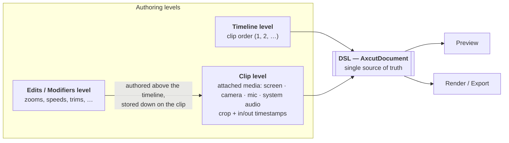
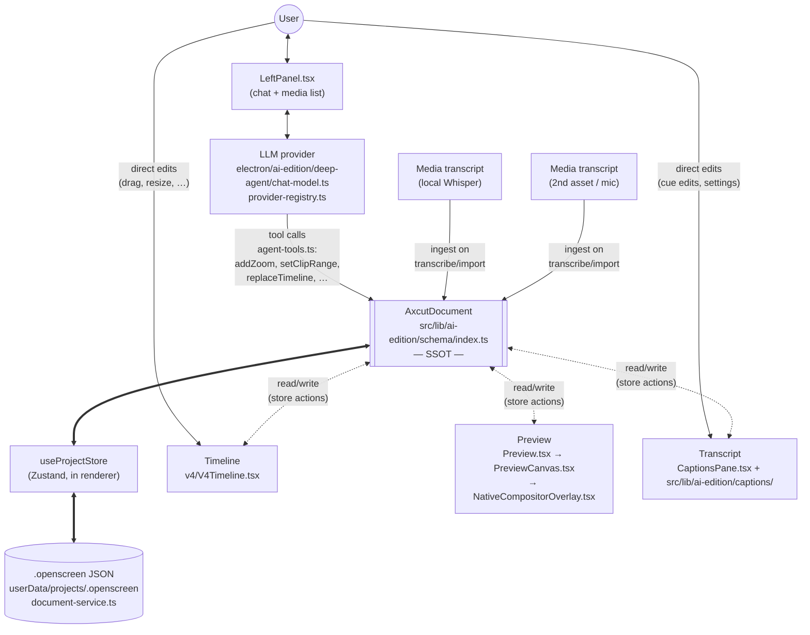

# Architecture overview

OpenScreen is an Electron + React + TypeScript screen recorder and video editor. The
main process lives in `electron/`; the renderer is a single Vite-built SPA whose entry
point is `src/App.tsx`. `App.tsx` reads `?windowType=` from the URL and lazy-loads one
window component. The four real window types — verified against `src/App.tsx:71-125`
and `electron/windows.ts` — are:

- `editor` — the main studio (`AiEditionShell`, `createEditorWindow`).
- `hud-overlay` — the floating record bar (`LaunchWindow`, `createHudOverlayWindow`).
- `source-selector` — the screen/window picker (`SourceSelector`, `createSourceSelectorWindow`).
- `countdown-overlay` — the pre-roll overlay (`CountdownOverlay`, `createCountdownOverlayWindow`).

A fifth, frameless `NotesWindow` is reached via a separate `showNotes=true` query,
not `windowType`.

The studio is built on a single source of truth — the `AxcutDocument` v5 Zod schema
described in [document-model.md](document-model.md). Every pane in the editor is a
view over the same in-memory document held in a Zustand store
(`src/lib/ai-edition/store/projectStore.ts`); the main process persists it as JSON in
the OS-standard user data directory via `electron/ai-edition/document-service.ts`.
What reads or writes the document, and how the user-facing surfaces hang off it, is
the subject of the rest of this page.

## Authoring levels

The editor presents three overlapping levels to the user, with one extra layer —
the document itself — sitting underneath them as the single source of truth:

The load-bearing point is that **modifiers are presented above the timeline in the
UX but stored down on the clip in the data**. A zoom the user draws over clip 2 lives
in `document.zoomRanges[]` but is anchored to that clip's `clipId` in source time; the
pill on the ruler is then projected back from the clip, not authored in ruler space.
That is exactly the invariant [timeline-model.md](timeline-model.md) exists to
protect, and the reason a second authoring layer was added on top of the clip
geometry instead of competing with it.

## Who reads and writes the document

The renderer holds one in-memory `AxcutDocument` and zero parallel "preview state"
or "timeline state" copies. Every pane reads from that document; every user action
goes back through it.

Read this diagram as two loops:

1. **Human loop.** The user edits the Timeline directly (clip reorder, region resize,
   skip placement) or talks to the Chat panel, which drives the LLM, which edits the
   document through the fixed tool schema — never raw JSON patches. Both paths
   converge on the same `AxcutDocument`.
2. **Machine loop.** Media assets get transcribed locally (Whisper via the renderer
   worker) and merged into `document.transcripts[]`. Preview and Timeline are pure
   projections of the document at a given time/zoom — there is no independent
   "preview state" to desync from the DSL.

Persistence (`useProjectStore` ↔ `.openscreen` file on disk) is a straight
serialize/deserialize of the same shape, not a separate model — see
[document-model.md](document-model.md#persistence).

## Where to go next

The four pages that explain the editing model itself, in the order they build on each
other:

1. [document-model.md](document-model.md) — the document every surface projects.
2. [timeline-model.md](timeline-model.md) — how time and modifiers are addressed inside it.
3. [editor-shell.md](editor-shell.md) — the surfaces the user drives.
4. [preview.md](preview.md) and [export-pipeline.md](export-pipeline.md) — the two consumers
   that turn the document back into pixels.

[decisions.md](decisions.md) records what is settled and what was tried and rejected —
read it before proposing a structural change. The full index of every architecture,
engineering and testing page is in [the tree README](../README.md).