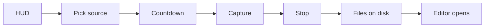

# Recording architecture

Recording is a cross-platform session coordinated by Electron and rendered by a platform capture path. The recorder and HUD live in `src/components/launch/` and `src/hooks/useScreenRecorder.ts`; native capture helpers for all three platforms live in `electron/native/`. Linux falls back to Chromium's display-media APIs only when its helper binary is missing.

## Lifecycle

The HUD starts and controls a recording. The source selector chooses a display or window and the countdown gives the user time to prepare. On Linux there is no in-app source selector: the compositor's portal picker takes its place. It is raised before the countdown, not during it — the helper negotiates the portal, reports `source-selected`, and then waits for `record` on stdin while the app counts down. Electron resolves the source and output paths, starts the selected capture backend, and records cursor telemetry alongside media. Stop finalizes the media and session files; the resulting paths are passed to the editor as recording assets.

## The HUD

`LaunchWindow` is the recording controller. Its control row exposes recording, pause, source, microphone, system-audio, webcam, cursor, settings, and stop/restart actions through the HUD controls. The overlay is click-through (`setIgnoreMouseEvents(true, { forward: true })` in `electron/windows.ts`), so it does not intercept the application being recorded; the HUD's own controls temporarily opt into pointer handling through the overlay IPC path.

Electron applies `setContentProtection(true)` to the HUD window (`electron/windows.ts:31`). This keeps the controller out of captures and also makes it invisible in screenshots. For a testing session only, `OPENSCREEN_DISABLE_CONTENT_PROTECTION=1` disables the protection; the code warns that the HUD then appears in captures. The tray icon is the reliable way to refocus OpenScreen or stop a recording when the click-through HUD is not convenient or is not visible.

## Capture backends

| Platform | Backend | Code | Produces |
| --- | --- | --- | --- |
| Windows | Windows Graphics Capture (WGC) helper (C++/Win32), with WASAPI and Media Foundation support | `electron/native/wgc-capture/` and `electron/windows.ts` | H.264 MP4 screen/window video; system/microphone AAC when enabled; webcam is muxed into the primary MP4 unless a separate webcam path is requested |
| macOS | ScreenCaptureKit helper (Swift), with AVFoundation/VideoToolbox encoding | `electron/native/screencapturekit/` and `electron/native/README.md` | H.264 MP4 screen/window video and ScreenCaptureKit system audio; microphone may be native where supported; webcam currently remains a separate Electron sidecar |
| Linux | PipeWire capture helper (Rust + C shim) driving the xdg-desktop-portal ScreenCast interface | `electron/native/pipewire-capture/` and `electron/native-bridge/capture/linuxNativeCaptureSession.ts` | H.264 MP4 screen/window video, PipeWire system/microphone audio, and cursor telemetry from one portal session; webcam stays an Electron sidecar |

The division is an invariant: the native helper owns capture, timing, and encoding; Electron owns session orchestration, output-path selection, persistence, and editor handoff. When the Linux helper binary is absent, the recorder falls back to the Electron `getDisplayMedia` path, which is the one case where Electron still owns the media.

## Helper contract

A native session is a child process boundary. Electron starts the platform helper with one structured JSON request and sends runtime commands on stdin; `stop` finalizes the output. The helper emits newline-delimited JSON events on stdout. The shared shape contains `schemaVersion`, `recordingId`, a `source` (display or window and its bounds), `video`, `audio`, optional `webcam`, optional cursor mode, and `outputs` paths. The helper reports `ready`, `recording-started`, warnings, errors, and `recording-stopped` events. Windows accepts legacy textual start/stop messages during compatibility handling; the structured events are the reference contract.

Stopping is the part of that boundary that has broken repeatedly (issues #34, #115, #252), so the Windows helper is explicit about it. On stderr it prints `[stop-timing] step=command-received` the moment it reads `stop`, then a `phase=begin` and a completion line per shutdown step; a step that never completes gets `phase=abandoned` and the process force-exits with code 3, plus a `stop-timeout` event on stdout naming the step. The distinction the older instrumentation could not make — "the helper never saw the stop" versus "it saw the stop and wedged" — is the first line of that log. Electron keeps a listener on the helper for the whole recording (`attachNativeWindowsCaptureOutputDrain`) so those lines reach the diagnostics bundle rather than being dropped between start and stop.

| Contract field or behavior | Windows | macOS | Linux |
| --- | --- | --- | --- |
| Schema | `schemaVersion: 2` | `schemaVersion: 1` | `schemaVersion: 1` |
| Source identity | `sourceId`, `displayId`, optional `windowHandle` | `sourceId`, `displayId`, optional `windowId` | **None, and none is possible.** See below |
| Video | FPS, dimensions, bitrate | FPS, dimensions, bitrate, and `hideSystemCursor` | FPS and optional bitrate; dimensions come from what the compositor negotiates |
| Audio | System loopback and selected microphone flags/device metadata | System audio and microphone flags/device metadata; microphone support is runtime-gated | System and microphone flags; the microphone is matched by PipeWire `node.description`, not by Chromium device id |
| Webcam | Native Media Foundation first, exact Electron-resolved DirectShow fallback; muxed into primary MP4 by default | Electron sidecar attached to the session | Electron sidecar attached to the session |
| Output | `screenPath`, session manifest, and optional `webcamPath` | `screenPath` and session manifest | `screenPath`, session manifest, and a `.cursor.json` sidecar |
| Runtime control | stdin pause/resume/stop/cancel; JSON events plus legacy text compatibility | Process events and the same lifecycle commands as the process boundary evolves | stdin pause/resume/stop; NDJSON events on stdout |

### Why Linux sends no source identity

`org.freedesktop.portal.ScreenCast.SelectSources` takes exactly `(session, cursor_mode, types, multiple, restore_token, persist_mode)`. There is no window id, monitor id, or node id a caller may supply, so the compositor's own picker is the only thing that can choose a source — the app cannot ask for one and cannot override the answer. The helper reports what it was given back on `stream-started` as `sourceKind` (`"monitor"`, `"window"` or `"virtual"`); that reply is the only knowledge the app ever has about what is being recorded, and an absent `sourceKind` means unknown, not "monitor".

Two consequences follow, and both were once bugs:

- **The HUD shows no source button on Linux.** An in-app picker cannot steer the portal, and the one that existed raised a *second* portal dialog of its own through `desktopCapturer.getSources()` whose grant was then discarded — which is why choosing a window there changed nothing.
- **No portal restore token is persisted.** Replaying one used to suppress the picker on later runs. Because a token is bound to the source it was minted for, an approved monitor came back on every subsequent recording and the picker — the only source chooser Wayland offers — never reappeared, so "record this window" recorded the whole screen. Answering the picker each time is the cost of being able to choose at all.

Electron resolves selected sources, devices, and paths before launching the helper. The helper does not guess a DirectShow camera: Windows receives the resolved selection. A helper error is reported explicitly rather than silently switching a Windows native feature to browser capture.

## Output files and sidecars

Windows and macOS both write their screen video as a fragmented MP4 — `MFCreateFMPEG4MediaSink` with a one-second `MF_MPEG4SINK_MIN_FRAGMENT_DURATION`, and `AVAssetWriter.movieFragmentInterval` respectively. A plain MP4 has no index until the writer's final call emits `moov`, so a helper that is force-exited before that leaves every captured frame on disk and no way to read them; that is why a frozen recording used to cost the whole file rather than its tail (issues #252 / #292 / #327). Fragmenting does not stop the freeze, it stops the freeze from destroying the recording. Windows falls back to the plain container if the fragmented sink is unavailable and reports which one it used in the `encoder-selection` event. Linux still writes a plain MP4: `frag_keyframe+empty_moov` would make the output permanently non-seekable and the native Linux path has no re-index step, so the editor's scrub cost has to be measured first.

A session writes a screen video and a `.session.json` manifest. Windows normally muxes the webcam into that MP4; when `webcamPath` is supplied, it writes a separate webcam video. macOS currently writes the webcam as a separate Electron sidecar (`webcamVideoPath`) because native webcam composition is not part of the helper. Linux follows the Electron recorder's separate media-path convention. Audio that the selected backend captures is encoded into its screen output.

Cursor samples are persisted as cursor telemetry rather than baked into editable-overlay recordings. The loader resolves the sidecar at `<videoPath>.cursor.json` or through the recording links; see [cursor.md](cursor.md) for the telemetry format and rendering path.

## Known gaps

- A window with odd client dimensions can produce black video: H.264 encoding requires even dimensions (`electron/native/wgc-capture/src/wgc_session.cpp:38`).
- The Windows helper's frame lock (`electron/native/wgc-capture/src/main.cpp`) is still held across blocking, uninterruptible D3D11 work: the WGC callback's `CopyResource`, and whatever the video writer does with the frame. A driver that stalls inside either one still costs the recording. What no longer happens is a hang: stop detection runs on `CaptureControl::stopMutex`, which no frame thread ever touches, and a shutdown watchdog force-exits the helper when a step overruns its budget, naming the step it died in. Each step gets `OPENSCREEN_WGC_STEP_BUDGET_MS` (8s by default) and that is the bound which normally fires; the whole shutdown is capped by `OPENSCREEN_WGC_STOP_BUDGET_MS` (50s by default), which the encoder-finalize step alone is allowed to spend in full because a long software-encoder finalize legitimately takes seconds (issue #34). Picking the D3D adapter that actually drives the captured monitor instead of adapter 0 is still outstanding.
- The video writer has two ways to get a frame to the encoder. Which one it uses is a setting first and a per-machine outcome second: the GPU path has to be asked for, and is then kept only if the machine supports it. The GPU path (`videoInput: "dxgi-nv12"`) copies the frame across a keyed-mutex bridge to a second D3D11 device, converts BGRA to NV12 with the D3D11 video processor, and hands the hardware H.264 encoder a DXGI sample; it never touches system memory. The CPU path (`videoInput: "cpu-rgb32"`) is the original staging-texture `Map(D3D11_MAP_READ)` readback, and is what a `Map`/`Unmap` that never returns wedges (issue #252: Windows 10, WDDM 2.7, multi-adapter). The GPU path is OFF by default; `OPENSCREEN_WGC_ENABLE_DXGI_INPUT=1` turns it on. Once asked for, it degrades to the CPU path at every check made **during initialization** — no hardware encoder, no NV12 video-processor output, no shared keyed-mutex texture, no DXGI sample allocator — so a machine it does not fit records exactly as it did before it existed. That fallback ends when the first frame arrives: a `captureDxgiSample()` failure after encoding has started stops the recording, because the sink writer is configured for NV12 by then and there is no path left to take. That gap is why the default is off, and it is what cost the reporter in #336 their recording. It is skipped outright for `preferSoftwareEncoder` and for inline webcam PiP, both of which need the frame in system memory, The two paths land on different encoders, so the GPU one asks for VBR explicitly through `ICodecAPI`: hardware MFTs default to constant bitrate and would spend the full configured budget on a static screen (measured 16.9 Mbps against 1.95 for the same desktop).
- Linux/Wayland can produce no usable frames on the `getDisplayMedia` fallback because Chromium initializes Vulkan against the Ozone Wayland backend. The PipeWire helper path is unaffected.
- On Linux the compositor's source picker appears on every recording. That is deliberate — see "Why Linux sends no source identity" — but it is an interruption, and there is currently no way to reuse a previous choice without also making it impossible to change.
- Holding a portal session across the countdown means the compositor's "screen is being shared" indicator is up before recording begins. That is honest — access really has been granted — but the user can click it to revoke, or close the window they picked. The helper's exit surfaces as a rejected `waitUntilSourceSelected`; the session is not yet subscribed to the portal's `Session::Closed` signal, so a revocation is reported as a failed start rather than a specific message.
- `preferSoftwareEncoder` is read when recording starts. The recorder has no UI for setting it; Windows also accepts `OPENSCREEN_WGC_PREFER_SOFTWARE_ENCODER=true` in the helper request path.
