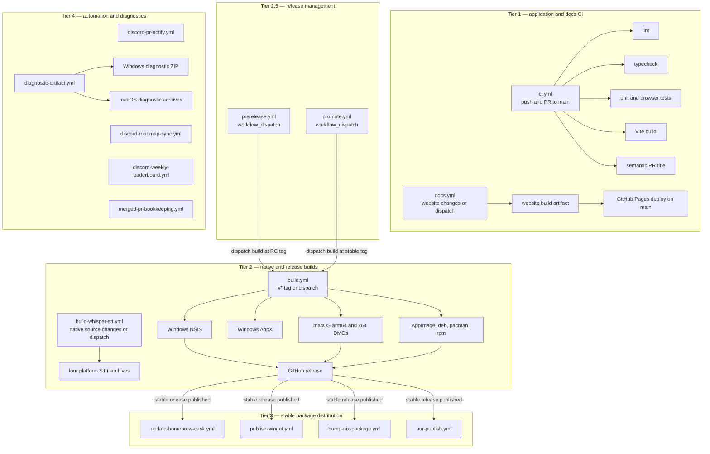

# GitHub Actions workflows

The repository's 15 workflow files under `.github/workflows/` cover application CI, release builds and management, package registries, native STT binaries, documentation deployment, and repository automation. This reference describes their verified triggers, dependencies, and artifact flow.

## Workflow dependency graph

The STT workflow uploads standalone archives for binary refresh and does not currently feed `build.yml` automatically; release packages consume binaries already staged in the source snapshot. Stable package workflows are additionally guarded against prereleases.

## Workflow inventory

| Tier | Workflow | Trigger |
|---|---|---|
| 1 | `ci.yml` | Push to `main`; pull request to `main` |
| 1 | `docs.yml` | Website/workflow changes on `main` or a PR; manual dispatch |
| 2 | `build.yml` | Any `v*` tag; manual dispatch |
| 2 | `build-whisper-stt.yml` | Native STT/build-script changes; manual dispatch |
| 2.5 | `prerelease.yml` | Manual dispatch |
| 2.5 | `promote.yml` | Manual dispatch |
| 3 | `update-homebrew-cask.yml` | Published release; manual dispatch |
| 3 | `publish-winget.yml` | Published release; manual dispatch |
| 3 | `bump-nix-package.yml` | Published release; manual dispatch |
| 3 | `aur-publish.yml` | Published release; manual dispatch |
| 4 | `discord-pr-notify.yml` | PR target, review, and issue-comment events |
| 4 | `discord-roadmap-sync.yml` | Merged PR to `main`; push to `main` |
| 4 | `discord-weekly-leaderboard.yml` | Monday 12:00 UTC schedule; manual dispatch |
| 4 | `merged-pr-bookkeeping.yml` | Closed pull request, conditional on merge to `main` |
| 4 | `diagnostic-artifact.yml` | Push or PR to `main`; manual dispatch |

## Tier 1: application and documentation CI

`ci.yml` runs independent `lint`, `typecheck`, `test`, and renderer-build jobs. Pull requests also run `semantic-pr`.

| Job | Runner | Command or purpose |
|---|---|---|
| `lint` | Ubuntu | `npm run lint` |
| `typecheck` | Ubuntu | `npx tsc --noEmit` |
| `test` | Ubuntu | Vitest unit tests, Chromium installation, then browser-mode Vitest |
| `build` | Ubuntu | `npx vite build`; this is not electron-builder packaging |
| `appstream` | Ubuntu | `appstreamcli validate` on `build/com.getopenscreen.OpenScreen.metainfo.xml` |
| `semantic-pr` | Ubuntu | Validates Conventional Commit-style PR titles |

`build/com.getopenscreen.OpenScreen.metainfo.xml` is upstream AppStream metadata: the name, summary, description, licence, screenshots and release history a software centre shows instead of a bare icon. Nothing in this repository consumes it yet — the shipped deb installs a `.desktop` file and nine icon sizes and no `/usr/share/metainfo/` at all — so the `appstream` job is the only thing that can catch a broken edit before a Flathub reviewer does. Its component ID is `com.getopenscreen.OpenScreen`, deliberately not the Electron `appId` `com.etiennelescot.openscreen`: Flathub requires the ID to map to a domain the project controls, and `getopenscreen.com` is that domain.

Jobs that need the root dependencies use `.github/actions/setup`, which requests Node 22 and runs `npm ci`; callers perform checkout themselves.

`docs.yml` is separate from the technical-documentation checker. It installs dependencies in `website/`, type-checks and builds the site, uploads a Pages artifact, and deploys only after a push to `main`.

## Tier 2: native and release builds

### `build.yml`

A `v*` tag or manual dispatch starts platform builds. Dispatch accepts `arch` (`arm64`, `x64`, or `both`) for macOS and an optional `release_tag` that enables publication.

- `build-windows` runs `npm run build:win` and uploads `openscreen-windows` for 30 days.
- `build-windows-store` runs `npm run build:win:store` and uploads `openscreen-windows-store` for 30 days.
- `build-macos` is an `arm64`/`x64` matrix. It builds Vite/Electron and native helpers, packages and optionally signs the app, creates DMGs, notarizes every signed build including pre-releases, and uploads one artifact per architecture for 30 days.
- `build-linux` produces AppImage, deb, pacman, and rpm files and uploads `openscreen-linux` for 30 days. It asserts one artifact per format before uploading, because `if-no-files-found: error` evaluates the union of the upload globs and so cannot catch a single format that stopped being produced. No zsync: that is electron-updater's delta format, this repo ships no updater, and app-builder-lib 26.x embeds a block map in the AppImage instead.
- `publish-release` waits for Windows NSIS, macOS, and Linux jobs; the Store job is not a dependency. It checks the tag against `package.json`, downloads the NSIS/macOS/Linux artifacts, and creates or updates a GitHub release with `OPENSCREEN_RELEASE_TOKEN`.

The build comments and package behavior refer to the local Whisper architecture documented in [transcription and captions](../architecture/transcription-and-captions.md). The STT model downloads to user data at runtime and is not a release-build asset.

### `build-whisper-stt.yml`

This matrix builds `whisper-stt-server` and its ggml backend sidecars for macOS arm64, macOS x64, Linux x64, and Windows x64. It uploads four 30-day archives named `whisper-stt-<platform>-<arch>`. The workflow installs the platform compiler dependencies and Vulkan SDK where configured. See [transcription and captions](../architecture/transcription-and-captions.md) for the runtime role of these binaries.

## Tier 2.5: release management

`prerelease.yml` and `promote.yml` orchestrate the frozen release branch, version tags, milestones, build dispatch, and Discord announcements. The full procedure, fallback, branch freeze, and credential requirements live in [release and secrets](release-and-secrets.md).

At a high level, the RC workflow creates or reuses `release/vX.Y.Z`, tags its tip, and dispatches `build.yml` at that tag. Promotion creates the stable version and tag from the same release branch, syncs it back through a PR, and dispatches the stable build at the tag.

## Tier 3: package registries

These workflows run for stable published releases and support manual replay with a tag:

- `update-homebrew-cask.yml` waits for both macOS DMGs, hashes them, writes a cask, and pushes to the configured tap. Manual replay refuses any tag that is not a stable `vMAJOR.MINOR.PATCH`, because `workflow_dispatch` takes free text and the `prerelease` filter only covers the `release` event.
- `publish-winget.yml` passes the matching NSIS release asset to `winget-releaser`.
- `bump-nix-package.yml` computes `npmDepsHash`, updates `nix/package.nix`, and opens a PR.
- `aur-publish.yml` hashes the pacman release asset, updates `PKGBUILD` and `.SRCINFO`, and pushes over SSH.

Each workflow needs variables or credentials, and where it checks for them decides whether a missing one is visible. `update-homebrew-cask.yml` and `publish-winget.yml` check inside a step that emits a warning, so an unconfigured channel says so in the run summary; a job-level `if:` would instead report `skipped`, which reads as green and hid #148 for eight releases and the Homebrew cask for its entire existence (#335). `bump-nix-package.yml` uses the repository `GITHUB_TOKEN`; the others require the external registry credentials described in [release and secrets](release-and-secrets.md).

## Tier 4: automation and diagnostics

- `discord-pr-notify.yml` mirrors PR events, reviews, and comments into a Discord forum thread. It is `continue-on-error`, so Discord does not block PR work.
- `discord-roadmap-sync.yml` updates a pinned Discord roadmap message after a merged PR or push to `main`.
- `discord-weekly-leaderboard.yml` posts a weekly contributor leaderboard.
- `merged-pr-bookkeeping.yml` finds closing issue references, applies pending-release labels and the rolling milestone, closes the issue, and adds an idempotent marker comment.
- `diagnostic-artifact.yml` builds WGC and ScreenCaptureKit helpers and bundles platform diagnostics. Its Windows ZIP and two macOS archives are retained for 14 days.

## Artifact flow

Release platform artifacts have 30-day Actions retention. `publish-release` copies the NSIS installer, two architecture-specific DMGs when present, and Linux packages into the GitHub release. It intentionally does not download the independently uploaded Store artifact. A stable published release then fans out to Homebrew, WinGet, Nix, and AUR.

Diagnostic artifacts remain Actions-only for 14 days. Whisper archives remain Actions-only for 30 days and are used as a binary-refresh output rather than being downloaded by the release workflow. The website build artifact flows only into GitHub Pages deployment.
